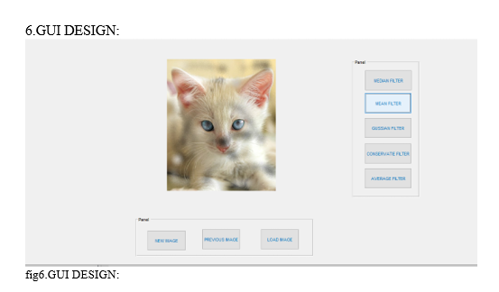
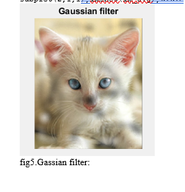
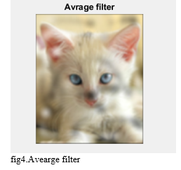
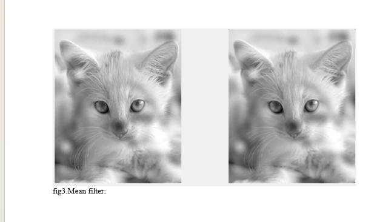

# Comparative Analysis of Image Processing Filters using MATLAB

This project presents a comparative study of spatial image filtering techniques implemented in MATLAB. The aim was to analyze how different filters affect image smoothing, noise reduction, and detail preservation, and to demonstrate the results through a simple graphical user interface (GUI).

## Overview

Image processing is used to convert images into digital form and apply operations that improve image quality or extract useful information. In a digital image, each pixel stores an intensity value. In an 8-bit grayscale image, pixel values range from 0 to 255.

Filtering is one of the most important operations in image processing. It is widely used to:
- remove noise
- smooth images
- preserve important features
- enhance edges
- improve visual quality

## Project Objectives

The objectives of this project were to:
- study common types of image noise
- implement multiple image filtering techniques in MATLAB
- compare filter behaviour for smoothing and noise reduction
- evaluate which filters preserve image quality more effectively
- design a MATLAB GUI for interactive filter selection

## Types of Noise

Common image noise includes:
- Gaussian noise
- Salt and pepper noise
- Shot noise
- Quantization noise

Noise introduces unwanted intensity variation in an image and can reduce visual quality and analysis accuracy.

## Filters Implemented

### 1. Mean Filter
The mean filter replaces each pixel by the average of the neighbouring pixel values.

**Advantages**
- simple to implement
- effective for basic smoothing
- reduces random noise

**Limitation**
- blurs edges and fine image details

### 2. Median Filter
The median filter replaces each pixel by the median value of the local neighbourhood.

**Advantages**
- effective for salt-and-pepper noise
- preserves edges better than mean filtering

**Limitation**
- may remove some fine detail

### 3. Conservative Filter
The conservative smoothing filter limits a pixel value within the minimum and maximum range of its local neighbourhood.

**Advantages**
- reduces impulse noise
- preserves image details better than average smoothing
- maintains edges more effectively

### 4. Weighted Average Filter
The weighted average filter gives more importance to the centre pixel than the surrounding pixels.

**Advantages**
- allows controlled smoothing
- reduces excessive blur compared to simple averaging

### 5. Gaussian Filter
The Gaussian filter is a linear smoothing filter based on the Gaussian distribution. Pixels near the centre of the kernel have greater influence.

**Advantages**
- produces natural smoothing
- commonly used in preprocessing applications

**Limitation**
- still softens edges

## MATLAB Implementation

Filtering was implemented in MATLAB using standard image-processing operations. In general form:

`B = imfilter(A, h)`

Where:
- `A` is the original image
- `h` is the filter matrix
- `B` is the filtered image

The project also included MATLAB code for GUI-based filter application and visualization.

## GUI Design


A GUI was created in MATLAB using GUIDE. The interface allows the user to:
- load an image
- apply different filters
- view original and filtered outputs
- interact with filter buttons directly

## Filter Results

### Gaussian Filter


### Average Filter


### Median Filter


### Mean Filter


### Conservative Filter


## Comparative Analysis

The implemented filters showed different behaviour depending on the type of smoothing and detail preservation required.

- The **mean filter** reduced noise but introduced noticeable blurring.
- The **median filter** gave better results for noise reduction while preserving edges.
- The **weighted average filter** allowed smoother blurring with centre-weight emphasis.
- The **Gaussian filter** produced visually smooth results and is useful for preprocessing.
- The **conservative filter** preserved important features more effectively than basic averaging.

## Key Result

Among the implemented smoothing techniques, the **median filter** and **conservative filter** provided better balance between noise reduction and edge preservation, while the **mean** and **average** filters produced more blur. The **Gaussian filter** gave smooth and visually pleasing output for general smoothing applications.

## Engineering Skills Demonstrated

- MATLAB programming
- digital image processing
- spatial filtering
- noise reduction analysis
- image smoothing and enhancement
- GUI-based application design
- comparative analysis of filter performance

## Applications

This project is relevant to:
- computer vision
- medical imaging
- image preprocessing
- satellite image analysis
- object detection
- pattern recognition

## Repository Structure

```text
image-processing-filters-matlab/
│── README.md
│── code/
│   ├── mean_filter.m
│   ├── median_filter.m
│   ├── gaussian_filter.m
│   └── GRAPHICALINTERFACE.m
│── images/
│   ├── gui_design.png
│   ├── gaussian_filter_result.png
│   ├── average_filter_result.png
│   ├── median_mean_filter_result.png
│   └── conservative_mean_result.png
